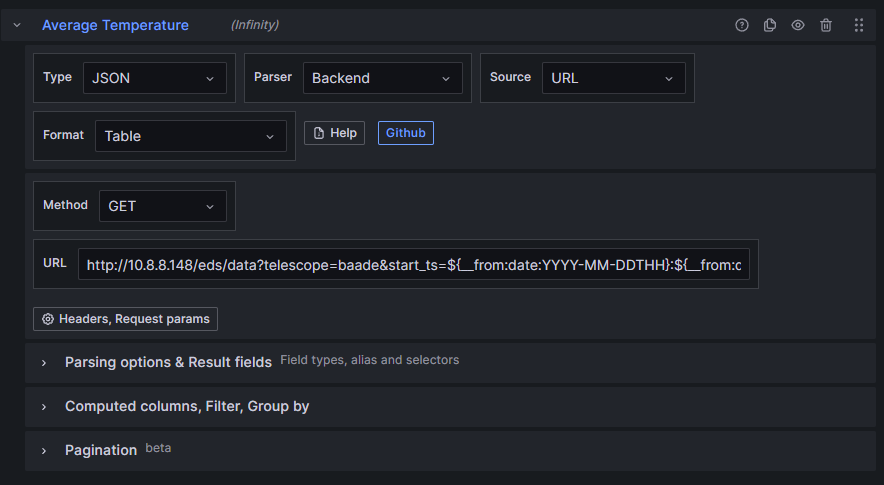
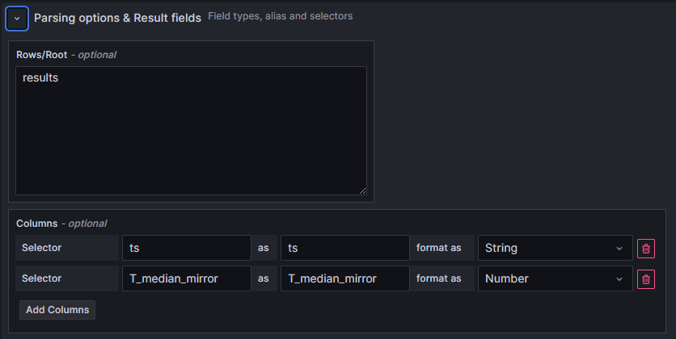
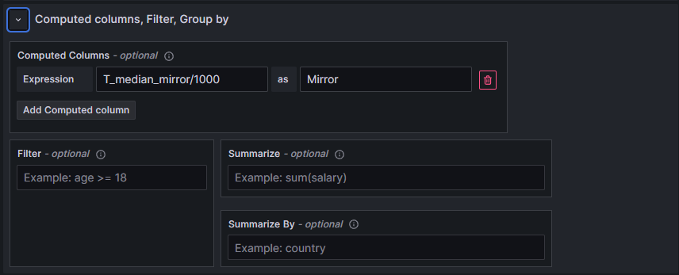
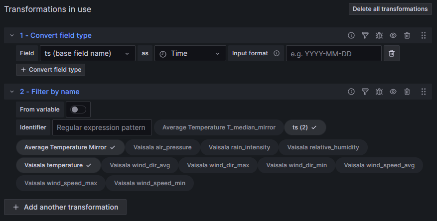
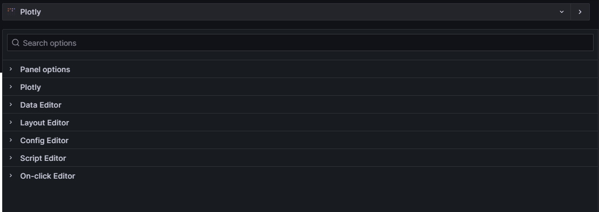
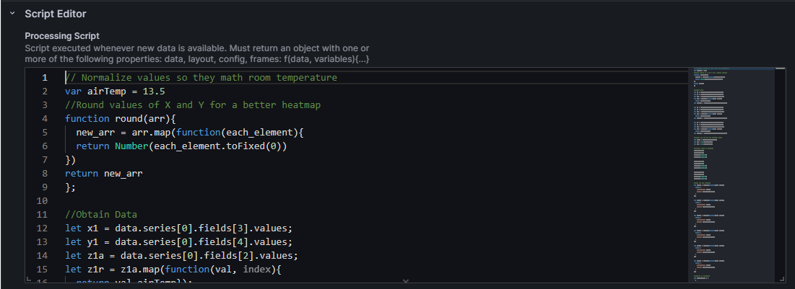

# Grafana Overview

## Getting Started with the Infinity datasource

[**Infinity**](https://grafana.com/docs/plugins/yesoreyeram-infinity-datasource/latest/) Plugin allows exploring data from different sources, such as JSON, CSV, and others.

This plugin makes the data extraction through different parsers, for the panels "Default" and "BackEnd" were used. In order to obtain data, we use the _Source_ selection marking it with "URL" (This must be instantiated every query). You can use hardcoded values for the query, or global variables, as illustrated on the following paragraph.
 
The queries developed using global variables, as the date from where you want to study, are redacted like this:
> \<endpoint...>start_ts=\${__from:date:YYYY-MM-DDTHH}:\${__from:date:mm}:\${__from:date:ss}

Note that the symbol ":" is not supported by the _from_ query, so the symbols are hardcoded outside the calling of the variable. 

### BackEnd Parser

The data in JSON format, is coded with a root, if we inspect the endpoint, the root name is _results_, therefore on the "Parsing options & Result fields" option, we declare the root value "results".

On the same section you can select the columns to parse and their data type. You must declare the original name of the column, the desired name and the data type you require. It is helpful to note that the data type parser **fails on "dates/timestamps"**. 

### Using Computed columns, Filter, Group By

To add a "computed column", you must declare an operation(based on another column) or constant value, then you name the new column accordingly. In this case the temperature is in Celsius * 1000 so the scale is not accurate when comparing to normal Celsius values (such as Vaisala), that is why we declare a division by 1000. 

## Using data transforms from Grafana

On most cases, data comes as a String, that is why we need to transform it if we want to make a numerical graph. Using this section is recommended, since it parses the datetime data correctly. The transform in question is "Convert Field Type", where you select a column and the desired data type. 

On the other hand, we use the "Filter By Name" transformation, since we are working with numerical columns we do not wish to display, we only select the desired columns (Temperatures and TimeStamps).

Note that all data transforms are performed after the computed columns and the declarations from the parser.

## Getting started with the Plotly JS plugin

The Grafana Plugin "Plotly", is based on Plotly js. When we first open the widget it is displayed as follows.

To make a graph we use the **Script editor** tab

To run the graph we must reload the query.

Check out the Wiki to understand how the graphs are coded, and the source code of each one.
